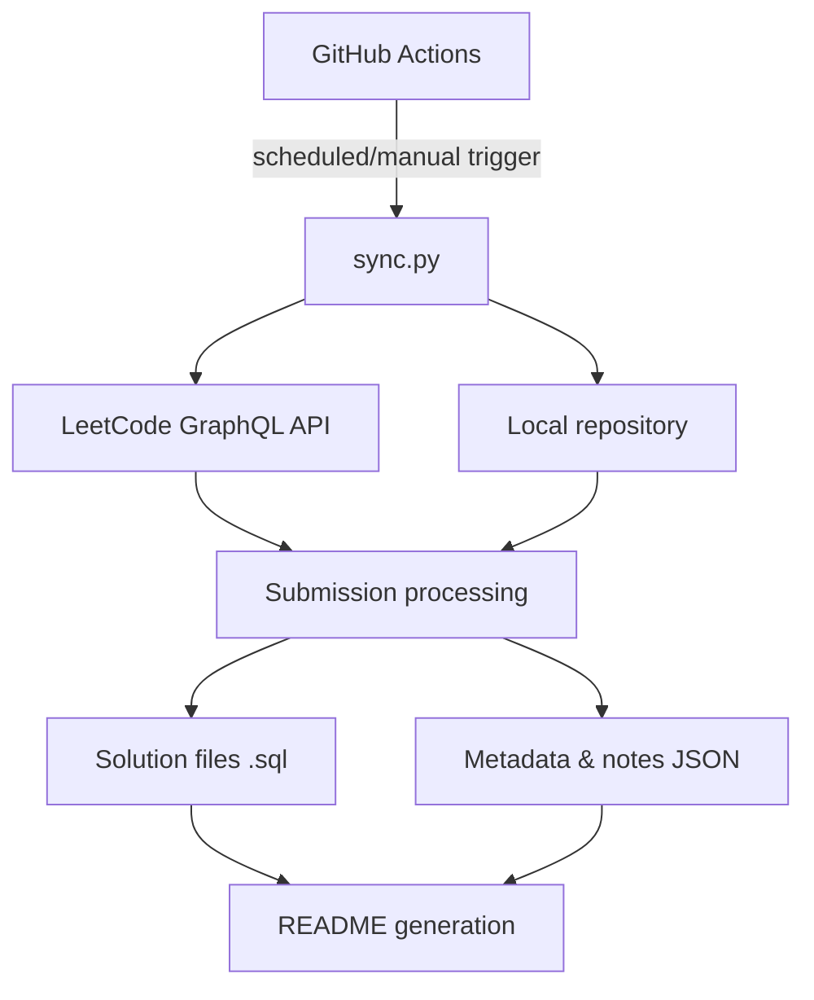

# CodeAtlas 

<p align="center">
  
</p>

**Status:** Pre-Alpha Testing


> An automated LeetCode solution synchronization platform that retrieves accepted submissions, organizes solutions, manages documentation, and tracks programming progress through GitHub Actions.

Last updated: 2026-08-12 20:48:44 EDT

---

# Statistics

| Difficulty | Count |
|---|---:|
| Easy | 43 |
| Medium | 26 |
| Hard | 2 |
| **Total** | **71** |

---

## Table of Contents

- [Statistics](#statistics)
- [Project Overview](#project-overview)
  - [What is this?](#what-is-this)
  - [Tech Stack](#tech-stack)
  - [Key Features](#key-features)
  - [Why was this built?](#why-was-this-built)
- [Design Decisions](#design-decisions)
- [Example Output](#example-output)
- [Setup Guide](#setup-guide)
- [Repository Structure](#repository-structure)
- [How It Works](#how-it-works)
- [Implemented Features](#implemented-features)
- [Incoming Features](#incoming-features)
- [Limitations / Known Issues](#limitations--known-issues)
- [License](#license)

---

# Project Overview

## What is this?

CodeAtlas is an automated solution archive designed to synchronize accepted LeetCode submissions into a structured SQL repository.

Instead of manually copying solutions, organizing files, tracking metadata, and maintaining documentation, this project automates the process through GitHub Actions and the LeetCode GraphQL API.

Currently focused on SQL solutions, this project automatically:

- Retrieves accepted LeetCode submissions
- Creates and organizes SQL solution files
- Tracks solution metadata and timestamps
- Maintains separate personal notes and explanations
- Generates repository statistics
- Keeps documentation synchronized with the repository

The long-term goal is to transform a simple solution archive into a continuously improving platform for analyzing, organizing, and exploring programming solutions.

## Tech Stack

- **Language:** Python 3.12
- **API Integration:** LeetCode GraphQL API
- **CI/CD:** GitHub Actions (scheduled + manual workflow dispatch)
- **Data Persistence:** JSON (metadata, notes, statistics)
- **Dependencies:** `requests`
- **Standard Library:** `zoneinfo` (timezone-aware timestamps), `re` (filename normalization), `json`, `os`
- **Version Control Automation:** Git (automated commits via GitHub Actions bot identity)

## Key Features

### Automated Synchronization

- Automatically retrieves accepted LeetCode submissions
- Generates organized solution files
- Runs through GitHub Actions
- No manual copying required

### Documentation System

- Personal notes stored separately
- Notes automatically injected into solutions
- Preserves original submission code

### Repository Management

- Automatic statistics generation
- Metadata tracking
- Solution organization
- README auto-updates

## Why was this built?

Learning software engineering often creates a documentation problem.

Developers build projects, learn new technologies, and solve problems, but the evidence of that growth becomes scattered across repositories, notes, and forgotten experiments.

CodeAtlas was created to solve this problem by automatically capturing progress, organizing solutions, and preserving the reasoning behind the code.

This project started as a 3:00 AM SYDEquest from a Python API-handling tutorial hell on a scuffed idea to automatically save and organize my LeetCode SQL progress without having to maintain files manually.

Over time, it evolved into a larger system focused on separating:

- The original solution code
- Personal learning notes
- Generated metadata
- Future analysis features
    
This allows solutions to remain unchanged while documentation, complexity analysis, tagging, and other features can continue improving after the solution is created.

---

<details>
<summary>Design Decisions</summary>
<a name="design-decisions"></a>

## Why Separate Notes From Solutions?

**Decision:** Solution code and personal documentation are stored in separate layers rather than as comments inside the submission itself.

- `*.sql` files - the submitted solution code and generated metadata (title, difficulty, timestamps, runtime)
- `leetcode_notes.json` - personal hints, explanations, and complexity notes
- `leetcode_meta.json` - generated repository metadata

**Why:** A common approach is writing notes directly into the LeetCode submission before solving. This project deliberately avoids that, so documentation can keep improving after a problem is solved without ever touching the original, already-submitted code - and so future automated analysis (complexity detection, pattern tagging, AI-assisted explanations - see [Incoming Features](#incoming-features)) has a clean layer to build on rather than parsing free-text comments out of code.

**Trade-off:** This adds a synchronization step where notes have to be correctly matched back to their solution file on every run, rather than using the simpler but less durable approach of directly editing the submission comment.

## Repository as the Source of Truth

**Decision:** The repository's own files are treated as ground truth, not the LeetCode API.

**Why:** Statistics are computed by counting existing `.sql` files on disk rather than trusting a running counter or re-querying the API. If LeetCode's API changes or synchronization temporarily breaks, the repository stays accurate and functional on its own.

**Trade-off:** Solution filenames are derived from the problem title, while metadata/notes are keyed by LeetCode's slug. These are expected to match but aren't strictly guaranteed to, a known constraint to keep in mind if problem titles ever contain unusual formatting.

## Credential Security

**Decision:** Authentication is handled entirely through GitHub Actions Secrets, never committed to source control.

**Why:** `LEETCODE_SESSION` and `LEETCODE_USERNAME` are injected as environment variables at runtime. Keeping credentials out of the repository entirely removes an entire class of accidental-exposure risk (no history to scrub, nothing to `.gitignore` correctly, nothing to accidentally push).

## Minimizing Unnecessary Repository Changes

**Decision:** Files are only written when their content actually changes.

**Why:** Generated output is diffed against the existing file before any write. This keeps the commit history meaningful (a commit means something actually changed), avoids triggering unnecessary downstream GitHub Actions runs, and reduces disk I/O on every sync.

</details>

---

<details>
<summary>Example Output</summary>
<a name="example-output"></a>

## Example: Generated Solution File

`leetcode/easy/find-users-with-valid-e-mails.sql`

​```sql
-- Find Users With Valid E-Mails
-- https://leetcode.com/problems/find-users-with-valid-e-mails
-- difficulty: easy
-- first_seen: 2026-08-01 20:11:01 EDT
-- runtime: 744ms

/*
Notes:
Hint: use regexp_like to get case sensitivity for the suffix, or use an extra
like binary. Watch out for the period in the suffix, which is a wildcard, so
put it in square brackets. [TC: O(N), 1 pass]
*/

select *
from Users u
where regexp_like(u.mail, '^[a-zA-Z][a-zA-Z0-9._-]*@leetcode[.]com$', 'c')
```

Every field above is generated automatically by `sync.py`: the header
(title, URL, difficulty, timestamp, runtime) and the code are written by
the sync engine on each run. The `Notes` block is the one exception as it's
independently maintained in `leetcode_notes.json` and re-injected into the
file without touching the surrounding code or header, so documentation can
keep improving without ever risking the submitted solution itself.

</details>

---

<details>
<summary>Setup Guide</summary>
<a name="setup-guide"></a>

## Installation

Clone the repository:

```bash
git clone https://github.com/Cir9no-0001/CodeAtlas
cd CodeAtlas
```

## Requirements

Before running CodeAtlas, make sure you have:

- Python 3.12+
- A LeetCode account with accepted submissions
- A GitHub repository (required for GitHub Actions synchronization)

Install dependencies:

```bash
pip install requests
```

## Authentication Setup

CodeAtlas requires LeetCode authentication to retrieve accepted submissions.

Choose one of the following methods:

1. GitHub Actions (recommended)
2. Running locally

### Option 1: GitHub Actions Setup (recommended)

This project uses GitHub Actions secrets to authenticate with LeetCode.

Navigate to: Repository -> Settings -> Secrets and variables -> Actions -> New repository secret

Add the following secrets:

1. `LEETCODE_USERNAME` (Your LeetCode username)
2. `LEETCODE_SESSION` (Your LeetCode session cookie)

To find LEETCODE_SESSION:

1. Open https://leetcode.com/
2. Log into your LeetCode account.
3. Open Developer Tools:
4. Chrome / Edge: F12 Or Ctrl + Shift + I
5. Navigate to: Application -> Cookies -> https://leetcode.com -> LEETCODE_SESSION
6. Copy the full cookie value.
7. Add it as a GitHub Actions secret: LEETCODE_SESSION = your_cookie_value

Keep this value private. This cookie provides access to your LeetCode session.

After completing authentication setup, run the workflow to synchronize your LeetCode submissions.

1. Navigate to:
   Repository -> Actions -> LeetCode Sync

2. Select:
   Run workflow -> Run workflow

3. Wait for the workflow to complete.

After a successful synchronization, CodeAtlas will:

- Create or update SQL solution files
- Update solution metadata
- Synchronize personal notes
- Refresh repository statistics
- Update README progress tracking

## Running Locally (Optional)

Set environment variables:

Windows PowerShell

```powershell
$env:LEETCODE_USERNAME="your_username"
$env:LEETCODE_SESSION="your_session_cookie"
```

Linux / Mac

```bash
export LEETCODE_USERNAME="your_username"
export LEETCODE_SESSION="your_session_cookie"
```

After setting the variables, run:

```bash
python sync.py
```

## Expected Output

Your repository should contain:

```text
leetcode/
├── easy/
├── medium/
└── hard/
```

along with updated:

- `leetcode_meta.json` (Tracks generated solution first-seen metadata)
- `leetcode_notes.json` (Stores personal notes and explanations)
- `leetcode_stats.json` (Stores repository statistics)

## Troubleshooting Checklist

- Your LeetCode account has accepted submissions.
- Your submissions are available through LeetCode's recent accepted submission history.
- LEETCODE_USERNAME matches your LeetCode username.
- LEETCODE_SESSION has not expired.
- The complete session cookie was copied correctly.
- GitHub Actions does not run
- GitHub Actions is enabled for the repository.
- Repository secrets are configured correctly.
- The workflow file exists in .github/workflows/.

</details>

---

<details>
<summary>Repository Structure</summary>
<a name="repository-structure"></a>

    .
    ├── sync.py
    ├── leetcode_meta.json
    ├── leetcode_notes.json
    ├── leetcode_stats.json
    ├── README.md
    │
    └── leetcode/
        ├── easy/
        │   └── *.sql
        │
        ├── medium/
        │   └── *.sql
        │
        └── hard/
            └── *.sql

</details>

---

<details>
<summary>How It Works</summary>
<a name="how-it-works"></a>

## Architecture



## Workflow

1. **Automation**
- GitHub Actions runs `sync.py` automatically on a scheduled interval.
- Manual synchronization can also be triggered through GitHub Actions.

2. **Authentication & API Connection**
- The script authenticates with the LeetCode GraphQL API.
- Credentials are securely stored through GitHub Actions secrets:
  - `LEETCODE_USERNAME`
  - `LEETCODE_SESSION`

3. **Submission Retrieval**
- The script queries LeetCode's `recentAcSubmissionList` GraphQL endpoint.
- The endpoint currently provides access to the 15 most recently accepted submissions.
- Retrieved submissions are processed and synchronized automatically.

4. **Metadata Collection**
- Additional GraphQL requests collect:
  - Problem title
  - Difficulty
  - Runtime performance
- Repository tracking timestamps are stored separately in `leetcode_meta.json`.

5. **Solution Generation**
- SQL solution files are automatically created or updated.
- Solutions are organized by difficulty:
    
    leetcode/
        ├── easy/
        ├── medium/
        └── hard/

6. **Metadata & Notes Separation**
- Automated metadata is stored separately from manual notes:
- `leetcode_meta.json` -> generated repository metadata
- `leetcode_notes.json` -> manually maintained explanations and hints
- Prevents API synchronization from overwriting personal documentation.

7. **Notes Synchronization**
- Manual notes are injected into SQL files independently from LeetCode API responses.
- Notes are formatted into SQL block comments.
- Long notes are automatically wrapped for readability.
- Existing SQL solutions are preserved while comments are updated.

8. **Repository Repair & Consistency Checks**
- Existing SQL files are scanned for missing note entries.
- Missing entries are automatically added to `leetcode_notes.json`.
- Recently detected accepted submissions can regenerate missing SQL files when available through the LeetCode API.

9. **Optimization & Reliability**
- LeetCode difficulty requests are cached to reduce unnecessary API calls.
- Problem titles are normalized into safe filenames.
- SQL comments and notes are reformatted consistently during synchronization.

10. **Statistics Generation**
- Solution counts are calculated from existing `.sql` files.
- `leetcode_stats.json` is updated.
- README statistics are automatically regenerated.

</details>

---

<details>
<summary>Implemented Features</summary>
<a name="implemented-features"></a>

## Automation & CI/CD

- [x] GitHub Actions automated synchronization
- [x] Scheduled workflow execution
- [x] Manual workflow triggering
- [x] Secure GitHub Secrets authentication
- [x] Automatic repository updates

## LeetCode Integration

- [x] Fetch accepted submissions through GraphQL API
- [x] Retrieve submitted SQL code
- [x] Retrieve problem difficulty
- [x] Track runtime performance
- [x] Cache repeated difficulty requests
- [x] Handle API failures

## File Management

- [x] Automatically create SQL solution files
- [x] Avoid unnecessary file rewrites when no changes occur
- [x] Organize solutions by difficulty
- [x] Clean problem titles into filenames
- [x] Preserve existing solutions
- [x] Avoid unnecessary file writes
- [x] Repair missing note entries and synchronize existing solutions

## Metadata System

- [x] Track when solutions are first added to the repository
- [x] Maintain `leetcode_meta.json`
- [x] Maintain `leetcode_notes.json`
- [x] Generate `leetcode_stats.json`
- [x] Timezone-aware timestamps

## Notes System

- [x] Separate manual notes from generated files
- [x] Automatically create missing notes
- [x] Inject notes into SQL solutions
- [x] Convert notes into SQL block comments
- [x] Preserve SQL code during updates
- [x] Wrap long notes automatically
- [x] Support comment format migration

</details>

---

<details>
<summary>Incoming Features</summary>
<a name="incoming-features"></a>

## Automated Analysis Features

- [ ] Automatic time complexity analysis
- [ ] Automatic space complexity analysis
- [ ] Generate solution explanations
- [ ] Generate problem summaries
- [ ] Detect inefficient queries
- [ ] Suggest SQL optimizations

## Organization

- [ ] Automatic solution tagging system:
  - JOIN
  - CTE
  - Window Functions
  - Subqueries
  - Aggregations
  - Ranking
  - Date Manipulation
  - etc

- [ ] Search and filter system
- [ ] Detect duplicate solutions
- [ ] Detect renamed files

## Analytics

- [ ] Progress graphs
- [ ] Daily/weekly/monthly solving streaks
- [ ] Difficulty distribution charts
- [ ] Advanced README dashboard

## Platform Expansion

- [ ] Multi-language support
- [ ] Automatically deploy a web interface/extension for browsing solutions through CI/CD
- [ ] Interactive solution explorer

</details>

---

<details>
<summary>Limitations / Known Issues</summary>
<a name="limitations--known-issues"></a>

## API Limitations

- The project currently relies on LeetCode's `recentAcSubmissionList` GraphQL endpoint.
- This endpoint only provides access to the 15 most recently accepted submissions.
- If a solution is missed because it falls outside this limit, the problem may need to be resubmitted on LeetCode to appear in synchronization.

## Current Scope

- Currently optimized for SQL LeetCode solutions.
- Multi-language support is planned but not currently implemented.
- Some metadata depends on information available through the LeetCode API.

## Repository Tracking

- `first_seen` represents the first time a solution was detected and added to this repository.
- It does not necessarily represent the actual date the LeetCode problem was first solved.

## Repair System

The repair system can restore missing or corrupted solution files when the problem is available through the recent accepted submission list.

However:

- Deleted solutions outside the API retrieval window cannot be automatically recovered.
- Manual edits to metadata files may not be recoverable.

</details>

---

## License

This project is source-available but **not open source**. Copyright (c)
2026 Stanley Chen — All Rights Reserved.

You may clone, fork, and run this project locally for personal, non-commercial
evaluation, testing, and code review. Commercial use, redistribution,
hosting as a service, and incorporation into other projects are not
permitted. See [LICENSE](LICENSE) for the full terms.
